# Technical Report: Multi-Agent Routing System

## Executive Summary

This document provides a detailed technical overview of the Multi-Agent Routing System built for Acme Corporation. The system uses LangChain to orchestrate multiple specialized RAG (Retrieval-Augmented Generation) agents that handle employee queries across four departments: HR, IT Support, Finance, and Legal.

**Key Achievements:**
- Multi-label intent classification for cross-domain queries
- Domain-specific RAG agents with isolated knowledge bases
- Full workflow observability via Langfuse
- Automated quality evaluation (bonus feature)

---

## System Architecture

### High-Level Overview

```mermaid
flowchart TB
    subgraph Input["📥 Input Layer"]
        CLI["CLI Arguments<br/>--question"]
        STDIN["Piped Input<br/>stdin"]
        REPL["Interactive REPL<br/>prompt_toolkit"]
    end

    subgraph Orchestrator["🎯 Orchestrator"]
        IC["Intent Classifier<br/>(GPT-4o-mini)"]
        Router["Router<br/>(RunnableLambda)"]
    end

    subgraph Agents["🤖 Specialized RAG Agents"]
        HR["HR Agent<br/>📋 PTO, Benefits, Policies"]
        Tech["Tech Agent<br/>💻 VPN, Passwords, Hardware"]
        Finance["Finance Agent<br/>💰 Expenses, Payroll"]
        Legal["Legal Agent<br/>⚖️ Contracts, Compliance"]
    end

    subgraph VectorStores["📚 FAISS Vector Stores"]
        VS_HR["faiss_index/hr<br/>122 chunks"]
        VS_Tech["faiss_index/tech<br/>80 chunks"]
        VS_Finance["faiss_index/finance<br/>83 chunks"]
        VS_Legal["faiss_index/legal<br/>79 chunks"]
    end

    subgraph Output["📤 Output Layer"]
        Synth["Synthesizer<br/>(Multi-agent merge)"]
        Eval["Evaluator<br/>(Quality scoring)"]
        Response["Final Response"]
    end

    subgraph Observability["👁️ Observability"]
        LF["Langfuse<br/>Tracing & Scores"]
    end

    CLI --> IC
    STDIN --> IC
    REPL --> IC
    
    IC -->|"intents[]"| Router
    Router -->|"hr"| HR
    Router -->|"tech"| Tech
    Router -->|"finance"| Finance
    Router -->|"legal"| Legal
    
    HR <--> VS_HR
    Tech <--> VS_Tech
    Finance <--> VS_Finance
    Legal <--> VS_Legal
    
    HR --> Synth
    Tech --> Synth
    Finance --> Synth
    Legal --> Synth
    
    Synth --> Eval
    Eval --> Response
    
    IC -.->|trace| LF
    HR -.->|trace| LF
    Tech -.->|trace| LF
    Finance -.->|trace| LF
    Legal -.->|trace| LF
    Synth -.->|trace| LF
    Eval -.->|score| LF
```

### Request Flow

---

## Component Details

### 1. Intent Classifier

The classifier uses GPT-4o-mini to perform **multi-label classification**, allowing queries to be routed to multiple departments simultaneously.

**Categories:**
| Intent | Description | Example Query |
|--------|-------------|---------------|
| `hr` | Time off, benefits, onboarding, conduct | "How do I request PTO?" |
| `tech` | Passwords, VPN, hardware, security | "How do I reset my password?" |
| `finance` | Expenses, payroll, budgets, vendors | "What's the expense policy?" |
| `legal` | Contracts, privacy, compliance, IP | "NDA signing process?" |
| `other` | Out of scope | "Best pizza in town?" |

### 2. RAG Agents

Each agent follows the same architecture pattern but with domain-specific configuration:

**Agent Configuration:**

| Agent | Documents | Chunks | Prompt Focus |
|-------|-----------|--------|--------------|
| HR | 8 files | 122 | Employee policies, benefits, procedures |
| Tech | 8 files | 80 | Technical support, troubleshooting |
| Finance | 10 files | 83 | Financial policies, expense rules |
| Legal | 12 files | 79 | Compliance, contracts, regulations |

### 3. Document Processing Pipeline

**Splitting Strategy:**
- **Chunk Size**: 800 characters (balances context and precision)
- **Overlap**: 200 characters (ensures continuity)
- **Separators**: `["\n## ", "\n### ", "\n\n", "\n", " "]` (respects document structure)

### 4. Synthesizer

When multiple agents respond, the synthesizer merges answers:

### 5. Evaluator (Bonus)

The evaluator scores responses on three dimensions:

---

## Data Flow Examples

### Example 1: Single-Domain Query

### Example 2: Multi-Domain Query

### Example 3: Out-of-Scope Query

---

## Langfuse Integration

### Trace Structure

### Captured Metrics

| Metric | Description |
|--------|-------------|
| Latency | Time per span and total |
| Token Usage | Input/output tokens per LLM call |
| Retrieved Docs | Documents returned by each retriever |
| Scores | Quality scores from evaluator |

---

## Technology Stack

---

## Performance Characteristics

| Operation | Typical Latency | Notes |
|-----------|-----------------|-------|
| Intent Classification | 0.5-1s | Single LLM call |
| Document Retrieval | 10-50ms | FAISS in-memory search |
| RAG Agent Response | 1-2s | Retrieval + LLM |
| Multi-Agent Synthesis | 1-2s | Additional LLM call |
| **Total (single-domain)** | **2-3s** | |
| **Total (multi-domain)** | **4-6s** | Sequential execution |

### Optimization Opportunities

1. **Async Execution**: Run agents in parallel (currently sequential)
2. **Caching**: Cache embeddings and frequent query responses
3. **Streaming**: Stream responses for better UX
4. **Model Selection**: Use faster models for classification

---

## Security Considerations

| Aspect | Implementation |
|--------|----------------|
| API Keys | Stored in `.env`, never committed |
| Vector Store | Local files, no network exposure |
| User Input | Passed to LLM (prompt injection risk) |
| Data Privacy | Documents stored locally |

### Recommendations for Production

1. Add input sanitization
2. Implement rate limiting
3. Add authentication/authorization
4. Use managed vector store with access controls
5. Enable audit logging

---

## Conclusion

The Multi-Agent Routing System successfully demonstrates:

✅ **Intelligent Routing**: Multi-label classification handles complex, cross-domain queries  
✅ **Domain Isolation**: Separate FAISS indexes prevent knowledge contamination  
✅ **LangChain Best Practices**: LCEL runnables provide clean, maintainable code  
✅ **Full Observability**: Langfuse traces enable debugging and monitoring  
✅ **Quality Assurance**: Automated evaluation catches low-quality responses  

The architecture is designed for extensibility—adding new departments requires only creating a new agent module and updating the orchestrator's routing table.
